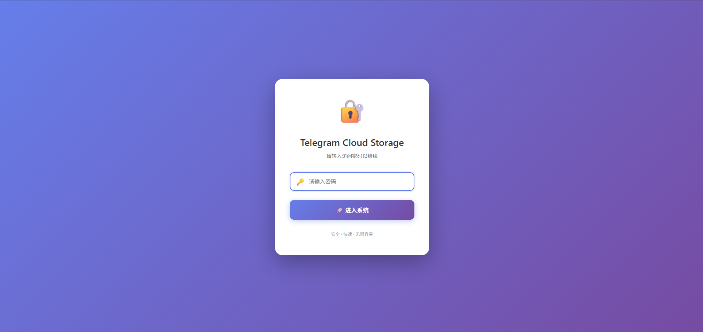
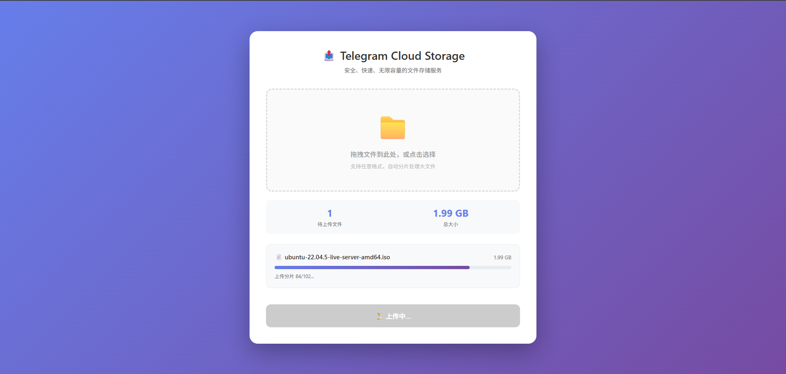
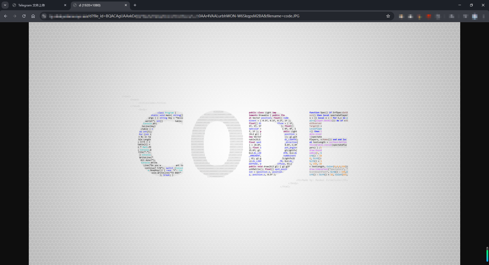
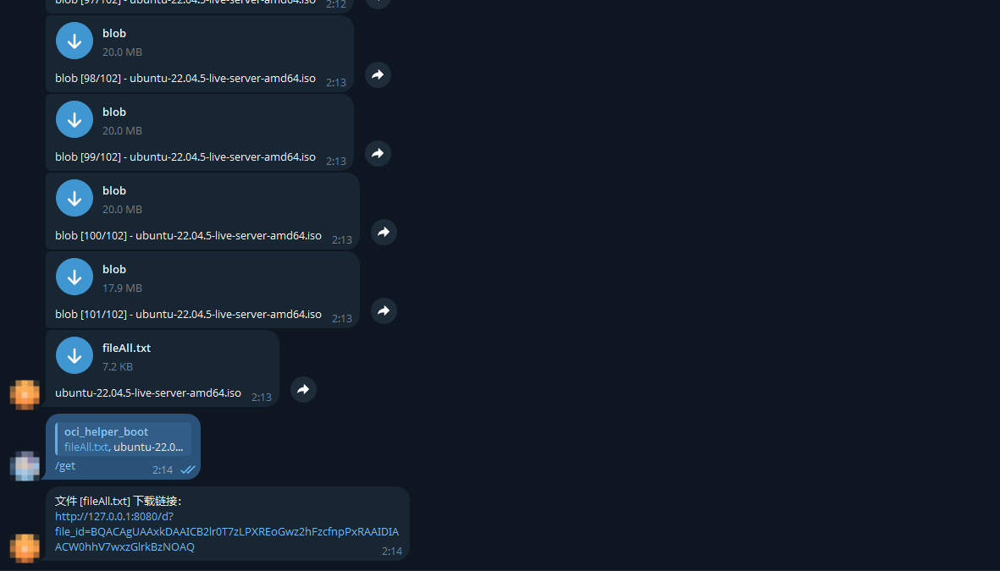

# tg-disk

> 🤖利用Telegram接口，♾️️无限容量，不限制文件格式，不限制文件大小（大文件会分块上传），不限制文件内容😏，占用很少的内存和磁盘空间📁（可执行文件不到6MB，docker镜像不到20MB），轻巧方便。 文件都存储在Telegram☁️端，拥有良好的安全性🔒和持久性。 上传成功会生成HTML、Markdown、BBCode三种形式的外链🔗，可以用来当做图床、文件下载url。文件下载时会使用多线程的方式，提升下载速度。

## 💻如何部署

### Docker部署

#### 1. 创建目录以及配置文件

```bash
mkdir -p /app/tg-disk && cd /app/tg-disk
```

```bash
# 自行修改后运行
cat > .env <<EOF
PORT=8080
BOT_TOKEN=7430196666:AAHgQ_XXX
CHAT_ID=6194666666
ACCESS_PWD=yohann
PROXY=
BASE_URL=

# Thread configuration (optional)
# Download threads for concurrent chunk download (default: 4)
DOWNLOAD_THREADS=4
# Frontend chunk size in MB (default: 20, due to Telegram limits)
CHUNK_SIZE_MB=20
# Frontend chunk upload concurrency (default: 4)
CHUNK_CONCURRENT=4
# Frontend file upload concurrency (default: 2)
FILES_CONCURRENT=2
EOF
```

**配置说明：**

| 配置项                | 说明                                     | 默认值    | 建议值 / 是否必填                   |
| ------------------ | -------------------------------------- | ------ | ---------------------------- |
| `PORT`             | Web 服务监听端口                             | `8080` | 可选（如端口冲突可修改）                 |
| `BOT_TOKEN`        | Telegram 机器人 Token                     | 无      | **必填**                       |
| `CHAT_ID`          | Telegram 个人 / 群组 ID（用于存储文件）            | 无      | **必填**                       |
| `ACCESS_PWD`       | 前端 Web 页面访问密码                          | 无      | **必填（强烈建议）**                 |
| `PROXY`            | Telegram 访问代理（仅支持 HTTP）                | 空      | 可选，如 `http://127.0.0.1:7890` |
| `BASE_URL`         | TG 机器人回复 `get` 或 `/get` 时生成的文件访问基础 URL | 空      | 可选，如 `https://example.com`   |
| `DOWNLOAD_THREADS` | **后端** Telegram 分片下载并发线程数              | `4`    | `4 ~ 8`                      |
| `CHUNK_SIZE_MB`    | **前端** 上传分片大小（MB，受 TG 限制）              | `20`   | `5 ~ 20`                     |
| `CHUNK_CONCURRENT` | **前端** 分片上传并发数                         | `4`    | `3 ~ 6`                      |
| `FILES_CONCURRENT` | **前端** 同时上传的文件数量                       | `2`    | `1 ~ 5`                      |

> 分片大小建议设置为5MB，否则内存占用太高，如需上传超大文件，需取消设置响应超时。

#### 2. docker-compose 一键部署

下载 [docker-compose.yaml](https://github.com/Yohann0617/tg-disk/blob/master/docker-compose.yaml) 文件到`/app/tg-disk`，如需配置**HTTPS**，建议修改为以下内容，防止其他人直接通过IP+端口直接访问：

```yaml
services:
  tg-disk:
    image: ghcr.io/yohann0617/tg-disk:master
    container_name: tg-disk
    restart: always
    ports:
      - "127.0.0.1:8080:8080" # 修改项，端口可以自行修改
    volumes:
      - .env:/app/.env
```

一键启动：

```bash
cd /app/tg-disk && docker-compose up -d
```

## 👶如何使用

部署成功后，直接`http://IP:端口`即可访问，支持同时上传多个文件，**文件大小无限制**，大于20MB的文件会分块上传，最后生成一个`fileAll.txt`文件。私聊机器人指定某个文件（如果是分块文件，指定`fileAll.txt`该文件）回复`get`或者`/get`，即可获取完整的URL链接，且分块文件下载时能够自动获取到文件名及后缀，无需修改下载文件名称。

## 🌏Nginx反向代理

核心配置：

```nginx
        location / {
            proxy_pass http://127.0.0.1:8080;
            proxy_set_header Host $host;
            proxy_set_header X-Real-IP $remote_addr;
            proxy_set_header X-Forwarded-For $proxy_add_x_forwarded_for;
            proxy_set_header X-Forwarded-Proto $scheme;
        }
```

## 🔑文件上传 API 示例

```bash
# url、文件路径自行修改
curl -X POST http://127.0.0.1:8080/upload -F "pwd=yohann" -F "file=@C:\Users\Yohann\Desktop\TikTok 21.1.0.ipa"
```

## 🔍页面展示











## ⭐Stargazers over time

[](https://starchart.cc/Yohann0617/oci-helper)
