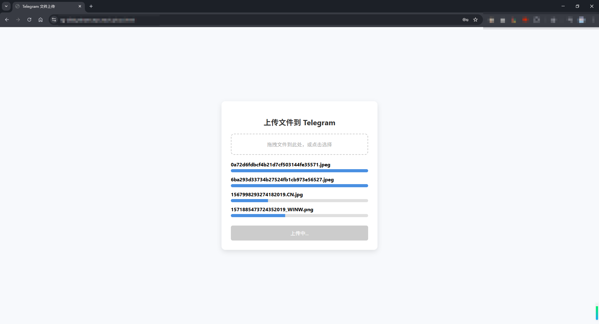
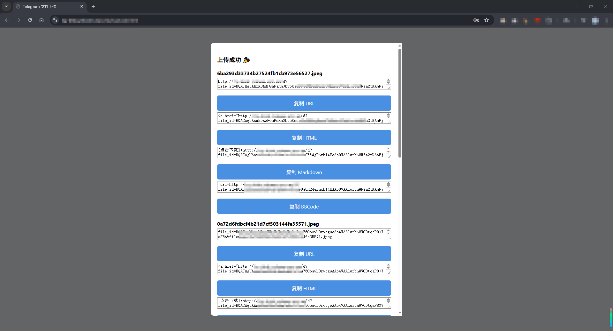

# tg-disk

> 🤖利用Telegram接口，♾️️无限容量，不限制文件格式，不限制文件大小（大文件会分块上传），不限制文件内容😏，占用很少的内存和磁盘空间📁（可执行文件不到6MB，docker镜像不到20MB），轻巧方便。 文件都存储在Telegram☁️端，拥有良好的安全性🔒和持久性。 上传成功会生成HTML、Markdown、BBCode三种形式的外链🔗，可以用来当做图床、文件下载url。文件下载时会使用多线程的方式，提升下载速度。

## 💻如何部署

### Docker部署

#### 1. 创建目录以及配置文件

```bash
mkdir -p /app/tg-disk && cd /app/tg-disk
```

```bash
# 自行修改后运行
cat > .env <<EOF
PORT=8080
BOT_TOKEN=7430196666:AAHgQ_XXX
CHAT_ID=6194666666
ACCESS_PWD=yohann
PROXY=
BASE_URL=

# Thread configuration (optional)
# Download threads for concurrent chunk download (default: 8)
DOWNLOAD_THREADS=8
# Frontend chunk size in MB (max: 20, due to Telegram limits)
CHUNK_SIZE_MB=10
# Frontend chunk upload concurrency (default: 4)
CHUNK_CONCURRENT=4
# Frontend file upload concurrency (default: 2)
FILES_CONCURRENT=2
EOF
```

**配置说明：**

| 配置项                | 说明                                     | 默认值    | 建议值 / 是否必填                   |
| ------------------ | -------------------------------------- |--------| ---------------------------- |
| `PORT`             | Web 服务监听端口                             | `8080` | 可选（如端口冲突可修改）                 |
| `BOT_TOKEN`        | Telegram 机器人 Token                     | 无      | **必填**                       |
| `CHAT_ID`          | Telegram 个人 / 群组 ID（用于存储文件）            | 无      | **必填**                       |
| `ACCESS_PWD`       | 前端 Web 页面访问密码                          | 无      | **必填（强烈建议）**                 |
| `PROXY`            | Telegram 访问代理（仅支持 HTTP）                | 空      | 可选，如 `http://127.0.0.1:7890` |
| `BASE_URL`         | TG 机器人回复 `get` 或 `/get` 时生成的文件访问基础 URL | 空      | 可选，如 `https://example.com`   |
| `DOWNLOAD_THREADS` | **后端** Telegram 分片下载并发线程数              | `8`    | `4 ~ 8`                      |
| `CHUNK_SIZE_MB`    | **前端** 上传分片大小（MB，受 TG 限制）              | `10`   | `5 ~ 20`                     |
| `CHUNK_CONCURRENT` | **前端** 分片上传并发数                         | `4`    | `3 ~ 6`                      |
| `FILES_CONCURRENT` | **前端** 同时上传的文件数量                       | `2`    | `1 ~ 5`                      |

> 分片大小建议设置为5MB，否则内存占用太高。如需下载超大文件，需取消设置响应超时或直接不配置HTTPS/CDN。

#### 2. docker-compose 一键部署

下载 [docker-compose.yaml](https://github.com/Yohann0617/tg-disk/blob/master/docker-compose.yaml) 文件到`/app/tg-disk`，如需配置**HTTPS**，建议修改为以下内容，防止其他人直接通过IP+端口直接访问：

```yaml
services:
  tg-disk:
    image: ghcr.io/yohann0617/tg-disk:master
    container_name: tg-disk
    restart: always
    ports:
      - "127.0.0.1:8080:8080" # 修改项，端口可以自行修改
    volumes:
      - .env:/app/.env
```

一键启动：

```bash
cd /app/tg-disk && docker-compose up -d
```

## 👶如何使用

部署成功后，直接`http://IP:端口`即可访问，支持同时上传多个文件，**文件大小无限制**，大文件会分块上传，最后生成一个`fileAll.txt`文件。私聊机器人指定某个文件（如果是分块文件，指定`fileAll.txt`该文件）回复`get`或者`/get`，即可获取完整的URL链接，且分块文件下载时能够自动获取到文件名及后缀，无需修改下载文件名称。

### 📥 下载模式说明

系统支持多种下载模式，通过 URL 参数 `mode` 指定：

| 模式 | 说明 | 适用场景 | URL示例 |
|------|------|----------|----------|
| `redirect` | 分片下载（推荐） | 配置了CDN（如Cloudflare）的环境，避免504超时 | `/d?file_id=xxx&mode=redirect` |
| `stream` | 流式合并下载（默认） | 未配置CDN的环境，服务器端合并后传输 | `/d?file_id=xxx&mode=stream` |

**💡 使用建议：**

1. **如果配置了 CDN（Cloudflare/Nginx 等）：**
   - 推荐使用 `mode=redirect`，系统会返回一个HTML页面，包含所有分片的直接下载链接
   - 避免因服务器合并文件耗时导致的 504 Gateway Timeout
   - 支持浏览器一键批量下载所有分片

2. **如果直连服务器（未配置 CDN）（推荐⭐）：**
   - 使用默认的 `mode=stream` 即可
   - 服务器会自动合并分片并流式传输给用户

3. **Telegram 机器人回复：**
   - 大文件（分片文件）会同时返回两种链接
   - 用户可根据实际情况选择合适的下载方式

## 🌏Nginx反向代理

核心配置：

```nginx
        location / {
            proxy_pass http://127.0.0.1:8080;
            proxy_set_header Host $host;
            proxy_set_header X-Real-IP $remote_addr;
            proxy_set_header X-Forwarded-For $proxy_add_x_forwarded_for;
            proxy_set_header X-Forwarded-Proto $scheme;
            
            # 大文件下载优化
            proxy_buffering off;                    # 禁用缓冲，允许流式传输
            proxy_request_buffering off;            # 禁用请求缓冲
            proxy_read_timeout 1800s;               # 读取超时30分钟（可适当调整）
            proxy_connect_timeout 300s;             # 连接超时5分钟
            proxy_send_timeout 1800s;               # 发送超时30分钟
        }
```

**❗ 重要说明：**

建议不要开启CDN，直连下载大文件速度更快。如果你使用了 **Cloudflare** 或其他 CDN，即使配置了上述参数，也可能遇到 **504 Gateway Timeout** 问题（CDN 通常有 100 秒超时限制）。

**解决方案：**

1. **使用 `mode=redirect` 下载模式（推荐）**
   - 在获取下载链接时使用 `mode=redirect` 参数
   - 系统会返回分片链接列表，用户可逐个下载或使用自动下载功能
   - 避免服务器端合并耗时，直接从 Telegram CDN 下载

2. **Cloudflare 优化设置**
   - 登录 Cloudflare Dashboard → 选择域名 → 规则 → Page Rules
   - 添加规则：`*yourdomain.com/d*`
   - 设置：Browser Cache TTL: 2 hours, Cache Level: Bypass
   - 或者直接将下载路径设置为灰色云朵（不经过 CDN）（推荐⭐）

## 🔑文件上传 API 示例

```bash
# url、文件路径自行修改
curl -X POST http://127.0.0.1:8080/upload -F "pwd=yohann" -F "file=@C:\Users\Yohann\Desktop\TikTok 21.1.0.ipa"
```

## 🔍页面展示







## ⭐Stargazers over time

[](https://starchart.cc/Yohann0617/oci-helper)
